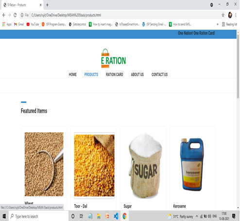

# E-RASHAN
<I>
    <h3>Introduction</h3>
    <h4>The Public Distributive system was established by the Ministry of Consumer Affairs to distribute basic Groceries
to Poor. 
The main reason for making this Android Application is to make the process digitalized and to remove the
drawbacks of the present System working based on the Ration card. In order to improve and make efficient the
current system of FPS, we are implementing E-Ration Shop. Using this authorized Ration cardholder can order
his/her groceries from the Ration shop online. So E-Ration Shop, Android Application to provide Knowledge of
all uses, benefits of Ration Shops and Avoiding the Major Problems Regarding the Ration shop. using this
android Application Authorized Ration Card Holders can take their ration i.e Jowar, Padi, rice, wheat and By this
way, Ration card Holders can Avoid standing in rows for a long time and there is no situation that Ration is
completed in the Ration Shop. Users will have Complaint forum to post their complaints regarding Ration Shop
and Admin will check their Complaints and Ration Card Holders can check the prices of the Groceries in the
Android Application and the Stock availability of each ration shop is available in the android application.

</h4>
<h3>Applications</h3>
    <ul>
        <li>This e-Ration Shop website is to give information related to card holders and to record all transactions.</li>
        <li>Aadhaar-enabled payment system (AEPS) for ensuring better transparency and accountability.</li>
        <li>No mechanism to identify inclusion errors such as duplicate, bogus and ineligible beneficiaries. As Aadhar card is unique human identity and hence this is used in the FPS to make it foolproof. Hence duplicate, bogus and ineligible beneficiaries can be avoided.</li>
         <li><b>Products Home delivery : </b> Products will be ordered and delivered to home easily . It will save time and will be helpful for those people also who are not able to go for shopping manually.</li>
    </ul>   
    <h3>Hardware Requirements</h3>
    <ul>
        <li>Intel Pentium 4 or later</li>
        <li>2 Gb RAM</li>
        <li>Operating system (Windows10 / Linux)</li>
    </ul>
     <h3>Technologies Used</h3>
    <ul>
        <li>MongoDB Database</li>
        <li>Express</li>
        <li>Angular</li>
        <li>Node JS</li>
        <li>HTML & CSS</li>
        <li>JavaScript</li>
    </ul>
<H3>Advantages</H3>
<ul>
    <li>The proposed system replaces the manual work in FPS.</li>
    <li>The prime objective of the designed system is the automation of FPS to provide transparency.</li>
    <li>The proposed automatic FPS for public distribution system is based on RFID technology and biometric authentication technology that replaces conventional ration cards.</li>
    <li>Managing huge users is made easy and simple</li>
    <li>Managing ration products and monitoring is made accessible easily.</li>
    <li>Readily uploads the latest updates and allows users to interact.</li>
    <li>There is no risk of data mismanagement at any level while the project is being developed.</li>
</ul>
<H3>Disadvantages</H3>
<ul>
    <li>It may provide incorrect results if data not entered properly.</li>
    <li>If RFID card is damaged, user won’t be able to use until he/she replaces the RFID card.</li>
</ul>
    <h3>Implementation</h3>
    <ul>
        <li>Home page of E-RationShop Application.</li> 
          
        <li>First user has to signup on the application.</li> 
          
        <li>Login page of the application.</li> 
          
        <li>Dashboard of the E-Ration application.</li> 
          
        <li>Application form for Ration Card</li> 
          
        <li>Products available on the E-Ration application</li> 
          
        <li>Product's information, stock and quantity.</li> 
         
         
         
          
        <li>Bill page of the E-Ration application</li> 
          
        <li>To contact us</li> 
          
        <li>Data stored in databse</li> 
          

    </ul>
    </I>
